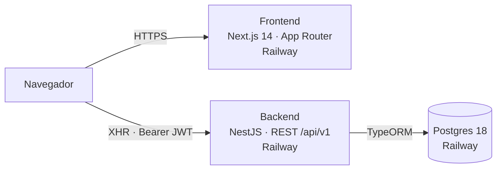

# Arquitetura Técnica — FinanceOS

Estado real em 31/07/2026. A arquitetura planejada em março (filas, cache Redis,
Open Finance, modo empresa) está em [`../planejamento19032026.md`](../planejamento19032026.md);
nada disso foi construído.

## Visão geral



O frontend **não** faz proxy das chamadas: o navegador fala direto com o backend,
usando `NEXT_PUBLIC_API_URL`. Por isso o CORS do backend precisa liberar
explicitamente a origem do frontend (`FRONTEND_URL`).

## Stack

| Camada | Tecnologia |
|---|---|
| Frontend | Next.js 14 (App Router), React 18, TypeScript, Tailwind, Zustand (persist), React Hook Form, Recharts, Axios |
| Backend | NestJS, TypeScript, TypeORM, Passport JWT, class-validator, bcrypt |
| Banco | PostgreSQL 18 (template `postgres-ssl` do Railway) |
| Build/Deploy | Nixpacks no Railway |

## Backend — organização

Módulos Nest em `src/modules/`, um por domínio: `auth`, `users`, `accounts`
(inclui cartões), `transactions`, `categories`, `budgets`, `goals`, `dashboard`
(inclui alertas). Cada um segue `controller → service → repository`:

- **controller** — rotas, guard de JWT, validação via DTO, extração do usuário
  pelo decorator `@CurrentUser()`;
- **service** — regra de negócio e acesso ao repositório;
- **entities/** e **dto/** — modelo e contratos de entrada.

Configurações transversais:

- prefixo global `api/v1` e CORS em `main.ts`;
- `ValidationPipe` global com `whitelist`, `forbidNonWhitelisted`, `transform`
  (ver o alerta no [contrato da API](../especificacoes/contrato-api.md));
- `JwtModule` global, segredo em `JWT_SECRET`, expiração em `JWT_EXPIRATION`;
- `GET /health` sem autenticação, para o healthcheck do Railway.

**Isolamento por usuário** é responsabilidade de cada service: toda query inclui
`userId`. Não existe filtro automático nem guard que garanta isso — um `where`
esquecido vaza dados entre contas. Já aconteceu uma vez (commit `b299834`).

## Frontend — organização

```
app/
  (auth)/login, (auth)/register     → públicas
  (app)/dashboard, transactions,    → protegidas pelo layout de (app)
        accounts, budgets,
        goals, categories
components/ui, components/layout
lib/api.ts        → instância Axios + interceptors
store/auth.store.ts → Zustand com persist em localStorage
types/index.ts    → tipos da API, escritos à mão
```

Todas as páginas são `'use client'` e buscam dados no `useEffect`. Não há Server
Components consumindo a API, nem cache de dados — cada navegação refaz as
chamadas.

**O ponto frágil:** `types/index.ts` é uma transcrição manual das respostas do
backend. Nada verifica que ele corresponde à realidade, e o TypeScript acusa
"tudo certo" mesmo quando os nomes divergem — o erro aparece como `undefined` em
tempo de execução, silenciosamente convertido em `0` pelos `?? 0` espalhados pela
UI. Foi a causa dos bugs de dashboard corrigidos em `df92372`.

## Autenticação — fluxo

1. `POST /auth/login` devolve `user`, `accessToken` (15 min) e `refreshToken` (7 dias);
2. Zustand persiste os três em `localStorage` sob `finance-os-auth`;
3. o interceptor de request lê o token do `localStorage` e monta o header `Bearer`;
4. o interceptor de response, ao ver 401, **limpa o storage e redireciona para
   `/login`**.

O passo que falta é o refresh: `POST /auth/refresh` existe no backend e não é
chamado por ninguém. Enquanto isso não mudar, o passo 4 acontece a cada 15
minutos de sessão.

Ler o token do `localStorage` também significa que ele é acessível a qualquer
script na página — um XSS entrega a sessão. A alternativa seria cookie
`httpOnly`, o que exigiria mudar o fluxo dos dois lados.

## Deploy — Railway

Projeto `finance-os` (`c36e00ec-56ea-4eb8-9485-a6356e44556a`), ambiente
`production`, três serviços: `frontend`, `backend`, `Postgres`.

**Os serviços não estão ligados ao GitHub.** `source.repo` é nulo nos dois — o
deploy acontece por CLI, a partir da máquina do desenvolvedor:

```bash
cd backend   && railway up --service backend  --project <id> --environment production --ci
cd frontend  && railway up --service frontend --project <id> --environment production --ci
```

Fazer `git push` **não** publica nada. Conectar o repositório ao Railway
eliminaria essa pegadinha e é uma melhoria recomendada.

### Armadilhas conhecidas do build

1. **`npm ci` no `buildCommand` quebra no Nixpacks** (EBUSY). O Nixpacks já roda
   `npm ci` na fase de install; repetir no build colide com o cache montado em
   `/app/node_modules/.cache`. O `buildCommand` deve ser apenas `npm run build`.
2. **O Railway injeta `PORT=8080`**, não 3000. Criar o domínio com
   `--port 3000` produz 502 silencioso: a app sobe, os logs parecem saudáveis, e
   o domínio roteia para uma porta onde ninguém escuta. Conferir sempre o
   `targetPort` contra a porta real dos logs.
3. **`railway up <path>`** como argumento falha com "prefix not found" — é
   preciso `cd` no diretório do serviço.
4. **Deploy verde ≠ app funcionando.** Só o healthcheck do backend valida de
   fato; o frontend precisa ser conferido com uma requisição real.

## Variáveis de ambiente

| Variável | Serviço | Observação |
|---|---|---|
| `DATABASE_URL` | backend | fornecida pronta pelo Postgres do Railway |
| `DATABASE_SSL` | backend | `true` fora da rede interna; ver `config/database-connection.ts` |
| `JWT_SECRET`, `JWT_EXPIRATION` | backend | |
| `JWT_REFRESH_SECRET` | backend | segredo separado do access token |
| `CARD_ENCRYPTION_KEY` | backend | obrigatória, mín. 32 caracteres; sem ela o boot falha. Trocá-la torna ilegíveis os cartões já salvos |
| `FRONTEND_URL` | backend | origem liberada no CORS |
| `BRAPI_TOKEN` | backend | opcional; cotações da brapi.dev. Sem ele, só os ativos de teste (PETR4, VALE3…) são cotados |
| `NODE_ENV` | backend | controla `synchronize` e logging do TypeORM |
| `PORT` | ambos | injetada pelo Railway (8080) |
| `NEXT_PUBLIC_API_URL` | frontend | embutida no bundle **em tempo de build** |

`NEXT_PUBLIC_API_URL` ser resolvida no build significa que mudá-la exige
**rebuild**, não basta reiniciar o serviço.

## Riscos e dívidas técnicas

**Segurança**

1. ~~`CARD_ENCRYPTION_KEY` com default hardcoded~~ — resolvido em 23/09/2026:
   o boot falha se a chave faltar, for curta ou for um dos valores de exemplo
   publicados no repositório. Continua valendo: o salt do `scrypt` é fixo, e a
   chave só existe nas variáveis do Railway — precisa de cópia fora dele.
2. Token em `localStorage`, exposto a XSS.
3. 38 vulnerabilidades reportadas por `npm audit` (4 baixas, 16 moderadas, 17
   altas, 1 crítica), sem triagem.
4. Isolamento por usuário depende de disciplina em cada query.

**Operação**

5. **Sem backup do Postgres.** Nenhuma rotina configurada. É o risco mais grave
   para um app financeiro.
6. Deploy manual por CLI, sem CI, sem testes rodando antes de publicar.
7. Sem observabilidade: nada de erro agregado, métrica ou alerta.
8. Conta do Railway em e-mail corporativo — perder o e-mail compromete acesso e
   cobrança de um app financeiro pessoal.

**Manutenção**

9. Tipos do frontend escritos à mão, sem verificação contra o backend (§ acima).
10. Formato de resposta não uniforme entre endpoints.
11. `synchronize` em dev e migrations em produção podem divergir silenciosamente.
12. Sem testes automatizados cobrindo os fluxos de escrita.

**Tarefas periódicas** (desde 23/09/2026): o backend roda no boot e a cada 6 horas,
com `setInterval`, a garantia das ocorrências de contas recorrentes (12 meses à
frente) e a busca de cotações. As duas são idempotentes, então rodar a mais ou
perder uma rodada não faz mal. Com mais de uma instância, cada uma rodaria as suas —
continua correto, só redundante.

## Próximos passos sugeridos, em ordem

1. Backup automático do Postgres.
2. ~~Falhar o boot se `CARD_ENCRYPTION_KEY` não estiver definida.~~ Feito em 23/09/2026.
3. Implementar o refresh de token no frontend.
4. Gerar os tipos do frontend a partir do backend (OpenAPI via `@nestjs/swagger`
   + geração de cliente) e eliminar a transcrição manual.
5. Conectar o Railway ao repositório, para que `push` publique.
6. Uniformizar o formato das respostas.
