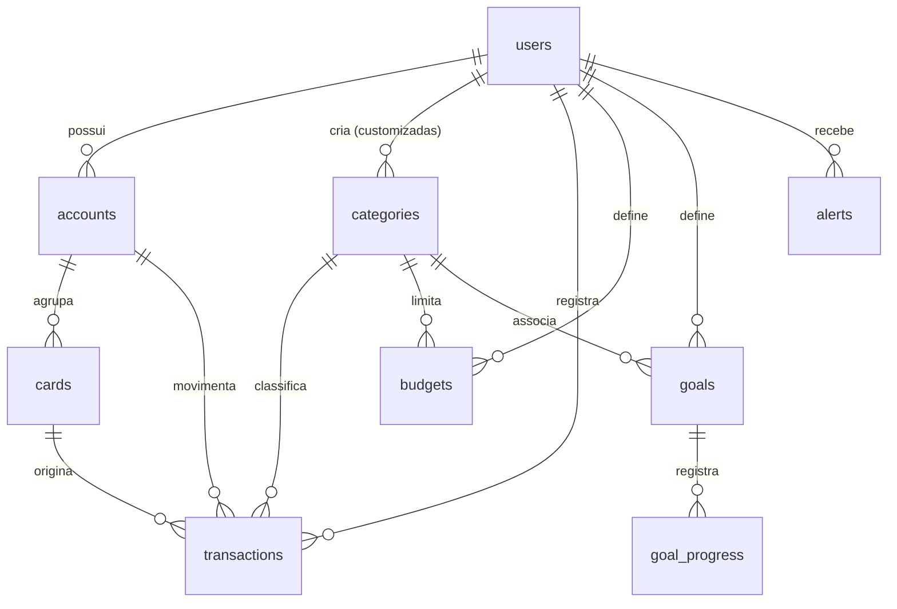

# Modelo de Dados — FinanceOS

Postgres, mapeado com TypeORM. Todas as chaves primárias são `uuid`
(`uuid_generate_v4()`). Datas de auditoria (`dataCriacao`, `dataAtualizacao`)
existem na maioria das tabelas e são preenchidas pelo ORM.

## Diagrama de relacionamentos



## users

| Coluna | Tipo | Notas |
|---|---|---|
| `id` | uuid | PK |
| `email` | varchar | indexado, único na prática |
| `passwordHash` | varchar | bcrypt |
| `nome` | varchar | |
| `avatarUrl`, `telefone`, `documento` | varchar | opcionais |
| `dataNascimento` | date | opcional |
| `moedaPadrao` | varchar | padrão `BRL` — **nunca lido pela aplicação** |
| `timezone` | varchar | padrão `America/Sao_Paulo` — **nunca lido** |
| `preferenciaTema` | varchar | padrão `light` — **nunca lido** |
| `ativo` | boolean | padrão true |
| `emailVerificado` | boolean | padrão false — **nunca muda** |
| `ultimoLogin`, `dataExclusao` | timestamp | opcionais |

## accounts

| Coluna | Tipo | Notas |
|---|---|---|
| `userId` | uuid | FK, `ON DELETE CASCADE` |
| `nome`, `tipo` | varchar | `corrente` \| `poupanca` \| `investimento` \| `carteira` |
| `banco`, `agencia`, `numeroConta` | varchar | opcionais |
| `saldoInicial` | numeric(15,2) | informado na criação |
| `saldoAtual` | numeric(15,2) | **mantido por efeito colateral das transações** |
| `moeda` | varchar | padrão `BRL` |
| `ativo` | boolean | só contas ativas entram no saldo consolidado |
| `cor` | varchar | usada na UI |

Índices: `['userId']` e `['userId', 'numeroConta']` único.

## cards

| Coluna | Tipo | Notas |
|---|---|---|
| `userId`, `accountId` | uuid | FK |
| `numeroCriptografado` | varchar | AES-256-CBC, chave em `CARD_ENCRYPTION_KEY` |
| `ultimosDigitos` | varchar(4) | único trecho em claro |
| `tipo`, `bandeira` | varchar | `credito` \| `debito` |
| `limite`, `limiteUtilizado` | numeric(15,2) | `limiteUtilizado` **nunca é atualizado** |
| `vencimentoFatura`, `dataFechamentoFatura` | int | dia do mês |

## categories

| Coluna | Tipo | Notas |
|---|---|---|
| `userId` | uuid **nullable** | nulo = categoria global do seed |
| `nome` | varchar | |
| `tipo` | varchar | `receita` \| `despesa` \| `ambos` |
| `categoriaPaiId` | uuid | hierarquia — **sem uso na UI** |
| `customizada`, `ativo` | boolean | |

Índice único `['userId', 'nome']`. Como as globais têm `userId` nulo, elas não
colidem com as do usuário — é possível ter duas categorias de mesmo nome
visíveis na mesma lista.

## transactions

| Coluna | Tipo | Notas |
|---|---|---|
| `userId`, `accountId` | uuid | obrigatórios |
| `cardId`, `categoryId` | uuid | opcionais, `ON DELETE SET NULL` |
| `contaDestinoId` | uuid | só em transferência, `ON DELETE SET NULL`; nulo nas anteriores a 23/09/2026 |
| `tipo` | varchar(20) | `receita` \| `despesa` \| `transferência` |
| `descricao` | varchar(255) | |
| `valor` | numeric(15,2) | sempre positivo; o sinal vem do `tipo` |
| `data` | date | data do fato |
| `dataCompetencia` | date | regime de competência — **sem uso na UI** |
| `recurso` | varchar | padrão `manual` |
| `recorrencia` | varchar(20) | gravado, **não gera ocorrências** |
| `recorrenciaGrupoId` | uuid | **nunca preenchido** |
| `proximoVencimento` | date | **nunca preenchido** |
| `tags` | simple-array | padrão `ARRAY[]::varchar[]` |
| `numeroNota`, `referenciaExterna` | varchar | opcionais |
| `reconciliada` | boolean | padrão false — **nunca lido** |
| `confirmada` | boolean | padrão true — **ignorado nos cálculos** |

Índices: `['userId','data']`, `['categoryId']`, `['accountId']`.

## budgets

| Coluna | Tipo | Notas |
|---|---|---|
| `userId`, `categoryId` | uuid | |
| `limiteMensal` | numeric(15,2) | |
| `gastoAtual` | numeric(15,2) | **coluna morta** — o valor exibido é recalculado a cada leitura |
| `mes`, `ano` | int | |
| `alertaPercentual` | int | padrão 80 |

Índice `['userId','mes','ano']`.

## goals e goal_progress

`goals`: `nome`, `valorAlvo`, `valorAtual`, `dataInicio`, `dataFim`,
`prioridade` (`baixa`\|`media`\|`alta`), `status` (`ativa`\|`pausada`\|
`concluída`\|`cancelada`), `categoryId` opcional.

`goal_progress`: snapshot append-only de cada aporte — `goalId`,
`valorAdicionado`, `percentualProgresso`, `dataRegistro`.

## alerts

`tipo`, `mensagem`, `descricao`, `entidadeTipo`, `entidadeId`, `severidade`
(padrão `info`), `lido`, `dataLeitura`.

**Tabela sempre vazia:** nada no sistema insere alertas.

## audit_log

A entidade `AuditLog` está registrada em `database.config.ts` e a tabela é
criada, mas **nenhum código escreve nela**.

---

## Migrations e `synchronize`

```ts
synchronize: configService.get('NODE_ENV') === 'development'
```

Em desenvolvimento o TypeORM ajusta o schema sozinho; em produção, **não** — o
schema vem de `src/database/migrations/` (`1785203201044-InitSchema.ts`),
aplicadas manualmente. Duas consequências:

1. Mudar uma entidade **não** altera o banco de produção. É preciso escrever a
   migration.
2. Como o schema local é gerado por `synchronize` e o de produção por migration,
   os dois podem divergir sem que nada acuse.

## Precisão numérica

Todo valor monetário é `numeric(15,2)`. O driver do Postgres devolve `numeric`
como **string**, não número — por isso o código faz `Number(...)` e
`parseFloat(...)` antes de qualquer conta. Esquecer essa conversão produz
concatenação de string em vez de soma, um bug silencioso e fácil de cometer.
